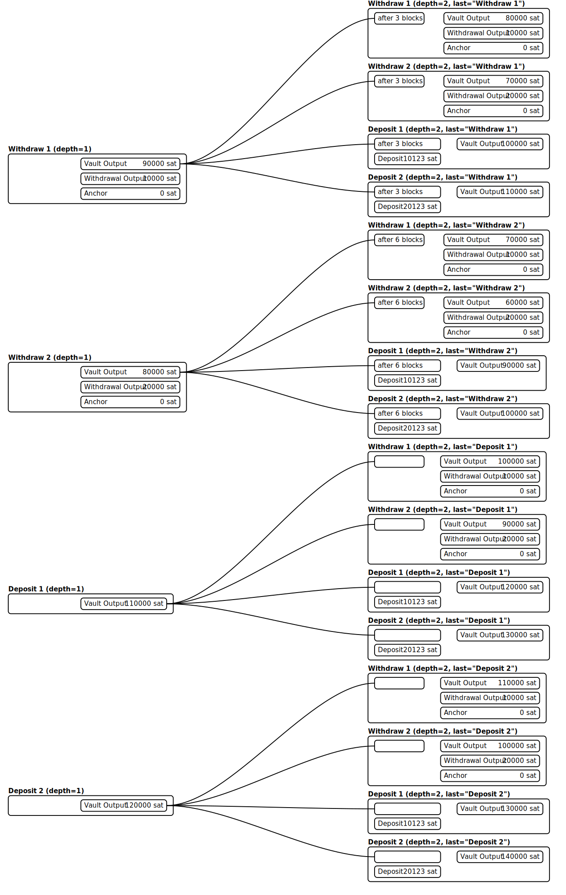
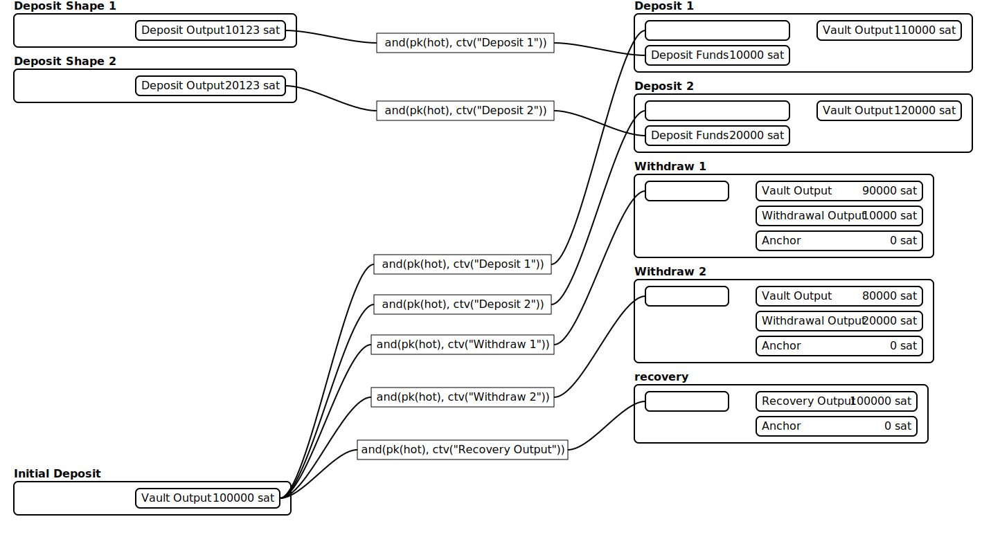
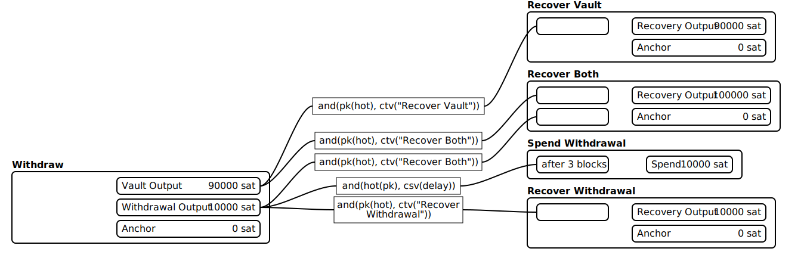

# MCCV Protocol Notes (Draft)

> [!NOTE]
> This document is somewhat of a work in progress.
> It covers most of the critical design components, and is now up-to-date, but it could use more revision than it's gotten.

## Goals

This vault protocol was designed to prevent catastrophic theft of funds even if ones keys have been compromised.

## Threat Model

## Intended Security Properties

MCCV is designed to mitigate theft of funds caused by compromise of the hot wallet.

An attacker who gains access to the hot wallet keys should be unable to immediately steal the full vault balance.
Instead, withdrawals are delayed and rate limited.
Rate limiting provides the user or a delegated watchtower time to detect unauthorized withdrawals and sweep the vault to the recovery key.

The protocol's consensus-enforced rate limiting also mitigates the scenario where the user or delegated watchtowers fail to detect unauthorized withdrawals in a timely fashion.
This rate limiting also mitigates losses if they fail to get the recovery transaction confirmed in a timely fashion.

## Security Assumptions

The security of this system depends on several critical assumptions:

* The recovery key must remain uncompromised.
* The user or a delegated watchtower must monitor the blockchain and respond to unauthorized withdrawals during the challenge period.
* Recovery transactions must be able to confirm on-chain before the withdrawal timelock expires in order to fully prevent all unauthorized withdrawals.
  * This includes the ability of the user or a delegated watchtower to independently provide fees for the recovery transaction(s).
* The precomputed vault graph must be generated correctly and verified by the user.
* Bitcoin consensus rules, including `OP_CHECKTEMPLATEVERIFY`, must behave as expected.

## Bitcoin Ecosystem Assumptions

* Consensus enforcing BIP-119 `OP_CHECKTEMPLATEVERIFY`
* Policy supporting Ephemeral Anchors - Required for propagation of zero-fee Deposit Shape, Withdrawal, and Recovery transactions
* Policy supporting Package Relay - Required for children to pay for the above transactions

## Out of Scope

MCCV is not intended to protect against:

* compromise of the recovery key
* malicious or buggy vault generation software
* prolonged loss of blockchain monitoring
* denial-of-service attacks preventing recovery transaction confirmation
* physical coercion attacks
* Bitcoin consensus failures

## Vault Structure

Vaults are deterministically derived from a small set of parameters:

* hot xpub - The xpub from which all hot keys are derived.
These keys authorize deposits, withdrawals, and sweeps to recovery.
* cold xpub - The xpub from which all cold keys are derived.
The cold keys are the recovery keys.
The user must keep the secret key material backing the cold xpub secret to maintain the security of the vault.
* `scale` - the base deposit and withdrawal increment. Every operation on the vault is in multiples of this number of satoshis.
* `delay` - blocks of delay per increment withdrawn
* `max-withdrawal` - maximum amount that may be withdrawn at once
* `max-deposit` - maximum amount that may be deposited at once
* `max-depth` - number of operations the vault can support (the depth of the DAG)

The vault itself is a precomputed directed acyclic graph of transaction outputs, enforced by consensus by `OP_CHECKTEMPLATEVERIFY`.
Every possible state and state transition is enumerated and committed to by the `OP_CHECKTEMPLATEVERIFY` hashes.
Each transaction has either a vault output, a withdrawal output, or both.

Transactions are ordered into "generation"s, every transaction within a generation is considered to have the same "depth".
Depth is the number of vault operations that have been performed on this vault prior to this transaction (within the history of this vault UTXO).
Depth never reflects vault operations on the vault done with a separate UTXO.
Vaults are intended to be a single continuous history.
If the user wishes to create an additional vault with otherwise identical parameters, the account index should be incremented.
Reusing identical vault parameters with multiple UTXOs directly links independent vaults together, and risks key reuse.
Furthermore, the current iteration of the software implementation does not adequately handle this scenario if done intentionally.

A vault output represents a vault in a particular state, with a balance, and the two previous vault operations (deposit or withdrawal) and implicitly a depth (the number of previous vault operations performed on this vault).
The two previous vault operations are necessary because the previous operation defines the shape of the current transaction, and the operation before that defines the `nSequence` relative timelock.
The current balance is not expressed in satoshis, but instead it is an integer that must be scaled by `scale` to get the actual value of the vault output.
The vault output's value is always `scale * balance`.

The vault output has taproot script paths for each potential subsequent vault operation, except for the last vault output, which can only be spent by the recovery keys.
The potential vault operations are: deposit some amount, withdraw some amount, sweep to recovery with a withdrawal output, sweep to recovery by itself.
Withdrawal outputs have three operations available by the script path: sweep to recovery with a vault output, sweep to recovery by itself, and spend once mature.
Vault and Withdrawal outputs are always spendable by the cold keys via the taproot key path.

> [!NOTE]
> `log_2( max-withdrawal + max-deposit + 2 )` must be less than 101 for Deposit transactions to remain within the size limits for TRUC transactions.
> This is only noted for completeness, as practical vaults are comfortably under 8.

## Performance

As suggested by the overview diagram, this scheme is quite computationally intensive.
Every transaction and transition between states must be computed and the transactions' `OP_CHECKTEMPLATEVERIFY` hash calculated.
Until up-to-date benchmarks are produced, the general performance characteristics of the vault on commodity hardware is as follows: computing vaults with hundreds of available operations can be accomplished in tens of minutes, depending on the other parameters.

## Deposit Operations

Deposits are always made in multiples of the vault's `scale`, so a vault with a scale of 10,000 sats might accept deposits of 10,000 sats, 20,000 sats, 30,000 sats and possibly more.
The maximum amount that can be deposited in a single deposit transaction is governed by the `max-deposit` parameter.

Deposits are made in a two step process.
First, the hot wallet creates a Deposit Shape transaction, which is a zero fee transaction with an output valued at the deposit amount + desired fee.
Because the vault only permits transactions from a finite precomputed set, the actual vault transaction requires an input of the appropriate size, which is what the Deposit Shape transaction provides.

The fee contribution is represented in the above diagram by the "Deposit Shape" transactions contributing 10,123 sats instead of just 10,000, with the 123 serving as a fee for the combined package.
Then, the deposit transaction is created, spending the previous vault output (if present) with the new deposit amount, creating a new vault output.
The desired fee is paid by the child deposit transaction, since the input to the deposit transaction is `vault_current + deposit_amount + desired_fee` and the output from the deposit transaction is `vault_current + deposit_amount`.

There are two versions of the vault transaction: one with a relative timelock, and one without.
The vault output following a deposit transaction does not have a relative timelock.
The vault outputs on withdrawal transactions always commit to vault transactions with a relative timelock equal to the relative timelock on the withdrawal output.
This ensures that an attacker can't just bypass the overall rate limit by issuing several withdrawals.

## Withdrawal Operations

Like [deposits](#deposit-operations), withdrawals are always made in multiples of the vault's `scale` up to a maximum defined by the vault's `max-withdrawal`.

Withdrawals are also achieved by a two step process.
The first step in the process is to create the withdrawal transaction.
Because the vault can only permit transactions from a finite precomputed set, the withdrawals must first move the withdrawn funds into an output with a fixed value and a fixed hot key.

The withdrawal transaction includes a timelock which is derived from the amount withdrawn by taking the number of increments withdrawn and multiplying it by the delay parameter.
The withdrawal output on the withdrawal transaction enforces the delay with a CSV, and the vault output (if present) enforces the delay indirectly with CTV which ensures the next vault transaction has the correct `nSequence`.
This withdrawal transaction will have a withdrawal output, an anchor output, and if there is a remaining vault balance, a vault output.

Before the withdrawal has matured, it can be [swept to the recovery key](#recovery-operations) by the user or their watchtowers.
Both the withdrawal output, and the vault output, if present, have spending paths to [sweep them to the recovery keys](#recovery-operations), both alone and together if applicable.
After it has matured, it can then be spent by the hot keys to the desired destination.
This means that the withdrawal output has three script path spends: hot key spend after maturity, sweep withdrawal output to recovery alone, and if there is a remaining vault balance, sweep withdrawal and vault balance together to recovery.

## Recovery Operations

Recovery transactions allow the user or their watchtower to sweep the vault and any pending withdrawals to a recovery key.

There are four variations on the recovery transaction:
- Spending only the vault output of a [deposit](#deposit-operations) transaction
- Spending only the vault output of a [withdrawal](#withdrawal-operations) transaction (ignoring the withdrawal output)
- Spending the vault and withdrawal outputs together of a withdrawal transaction
- Spending only the withdrawal output of a withdrawal transaction (ignoring the vault output, or when the vault output is not present because the withdrawal empties the vault)

Spending a vault output with a recovery transaction ends the vault.

The recovery transaction always has two outputs, an output spendable by a recovery key, and an anchor output.
Recovery keys are derived from the cold xpub, every level of depth has a unique recovery key.

The anchor output is used so that a child transaction can pay for the recovery transaction's fees.

## Future Improvements

### Delegated Recovery Key

Probably the biggest omission from the current design is that there's no way for a delegated agent to sweep coins to the recovery key without also giving them the ability to initiate withdrawals.
A simple key delegation from the hot key to a delegate key using `OP_CHECKSIGFROMSTACK` in a dedicated tap leaf would accomplish this.
This would enable users to delegate only the authority to initiate recovery to watchtower services.
This is a pretty simple change, and I'd like to get to it as quickly as I can.

### Standalone Watchtower

This is probably the biggest omission from the current *implementation*, I expect to do this in the near term.
You can manually perform watchtower functions, enough to demonstrate the functionality of the protocol, but it'd be nice to have something automated.
It will be fairly easy to do, I just need to move on to other work ASAP right now.

### Sweep to delegate

I don't have an exact design for this in mind, but the idea is to provide a plausible backup in case of lost keys.
A company particularly in a collaborative custody setup could have an option to sweep the vault into their custody.
This would be encumbered with a very long timelock (on the order of months) during which the user can sweep to their recovery address (the same as if an unauthorized withdrawal was initiated).

### Caching

Large vaults can take minutes to compute, and right now the MCCV recalculates the entire vault repeatedly.
The simplest thing to do is cache every N generations on disk, this brings the computation time back into a reasonable order at the expense of disk space.

### Optimization

There are plenty of micro and macro optimizations still left.
On the macro side, the vault code doesn't universally use the `Context` object for in-memory cached computations, that's an easy win.
On the micro side, converting the CTV computation code from building a `rust-bitcoin` `Transaction` to streaming it into a hash is a substantial win in [related benchmarks I've done](https://github.com/Ademan/rust-bip119-bench?tab=readme-ov-file#results).

### STARK Proofs

I want to call special attention to this idea.
The biggest problem with this protocol, in my opinion, is that it is too CPU intensive to run on a hardware wallet, but initial vault setup must be performed on a trusted device.
Resolving this tension would be tremendously valuable.
I have to admit I don't know how feasible it is, but if a hardware wallet could *verify* that the vault was generated correctly it would provide a satisfying resolution.
This allows the heavy computation to be performed on powerful consumer hardware, but trust to reside in the hardware wallet.
With that, I think there is a very compelling user story that is otherwise considerably weaker.
Of course, it still remains to be seen if this approach is feasible.
The verifier code must be compact enough to fit on a hardware wallet along side existing wallet functionality, and be performant enough for vault verification to be acceptably quick.
Likewise, after computing a large vault, generating the proof must be reasonably fast as well.

### Generalizing

MCCV demonstrates a style of contract that can be built using `OP_CHECKTEMPLATEVERIFY`, but a large portion of the code can be reused for other contracts.
I began some work on generalizing it, but there's a lot more left to do.
It's also very worth exploring if investing time into optimizing [sapio](https://learn.sapio-lang.org/) is a better use of time.
Most of `MCCV`s speed came from exploiting the structure of the vault to facilitate parallelism and those benefits could be lost if I try to make this software too generic.

### GPU Acceleration

With some work, GPU acceleration could substantially improve the time it takes to generate the vault context.
This could definitely be valuable in making larger vaults practical to compute, but a much higher priority in my opinion, is to figure out how to make vault generation practical to either generate, or verify on hardware wallets.

### `OP_TEMPLATEHASH`

Templatehash is a drop-in replacement for `OP_CHECKTEMPLATEVERIFY` for the purposes of MCCV.
I'd like to make the covenant opcode a feature flag so that either can be used, but I want to address [Optimization](#optimization) first.
The streaming hashing has a deep impact on how MCCV interacts with both `OP_CHECKTEMPLATEVERIFY` and `OP_TEMPLATEHASH` so I'd like to nail that down *first*.
On the other hand, it also would take barely an afternoon to swap in `OP_TEMPLATEHASH` the way `OP_CHECKTEMPLATEVERIFY` is currently used, so maybe I'll do it sooner.
